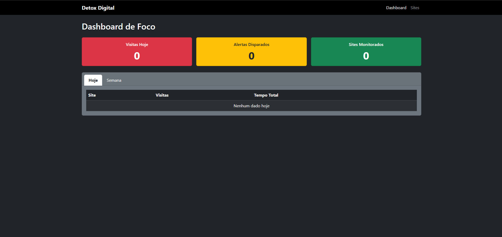
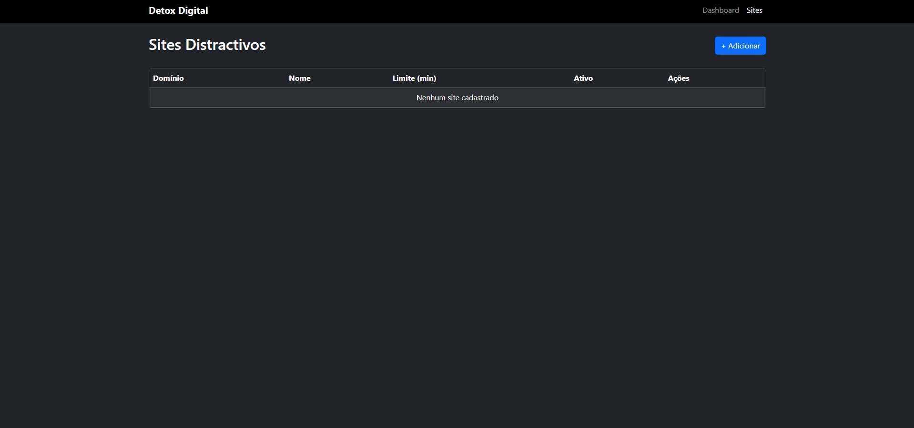
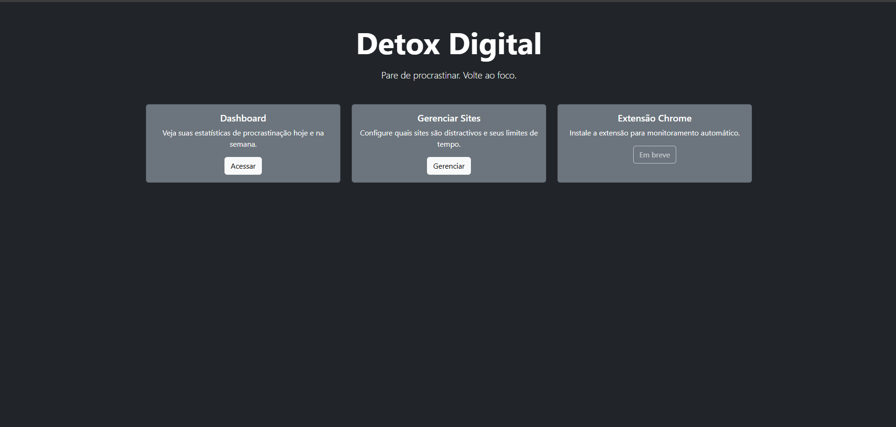

<p align="center">
  
</p>

<h1 align="center">Detox Digital</h1>

<p align="center">
  <i>Pare de procrastinar. Volte ao foco.</i>
</p>

<p align="center">
  
  
  
  
  
</p>

---

## O que e?

O **Detox Digital** e um sistema full-stack feito pra ajudar voce a parar de perder tempo em sites que nao agregam nada. Funciona assim: voce configura quais sites sao distrativos, define um limite de tempo por sessao, e a extensao Chrome fica de olho. Quando o limite e atingido, um alerta e disparado. Simples assim.

## Funcionalidades

- **Dashboard de Foco** — Visualize suas estatisticas de procrastinacao: visitas, alertas e tempo total gasto em cada site (hoje e na semana)
- **Gerenciamento de Sites** — Adicione, remova e configure o limite de tempo por sessao para cada site distrativo
- **Extensao Chrome** — Monitora automaticamente o tempo que voce passa nos sites e alerta quando o limite e atingido
- **Alertas Inteligentes** — Notificacao em tempo real quando voce ultrapassa o tempo configurado
- **Banco Persistente** — Todas as suas estatisticas sao salvas e podem ser consultadas a qualquer momento

## Como Funciona

<p align="center">
  
</p>

1. Voce acessa o **Dashboard** e ve suas estatisticas em tempo real
2. No painel de **Sites**, adiciona os sites que quer monitorar e define o limite de minutos
3. A **extensao Chrome** rastreia automaticamente o tempo que voce passa em cada site
4. Quando o limite e atingido, voce recebe um **alerta** avisando que ja basta

## Stack

| Componente | Tecnologia | Por que? |
|------------|-----------|----------|
| Backend | Spring Boot 4.1.0 + Java 21 | Robusto, maduro e com excelente ecossistema |
| Banco de dados | H2 (file-based) | Leve, sem necessidade de instalar nada extra |
| Frontend | Thymeleaf + Bootstrap 5 | Template engine intuitivo com UI responsiva |
| Extensao | Chrome Extension (Manifest V3) | Padrao atual do Chrome, segura e performatica |
| ORM | Spring Data JPA + Hibernate | Abstrai o acesso ao banco de forma elegante |

## Como Rodar

```bash
# Clone o repositorio
git clone https://github.com/2jjj/detoxdigital.git
cd detoxdigital

# Execute com o Maven Wrapper
./mvnw spring-boot:run
```

O servidor inicia na porta **3000**. Acesse:

| Rota | Descricao |
|------|-----------|
| `localhost:3000` | Pagina inicial |
| `localhost:3000/dashboard` | Dashboard de estatisticas |
| `localhost:3000/sites` | Gerenciar sites distrativos |
| `localhost:3000/h2-console` | Console do banco de dados |

## Instalando a Extensao Chrome

<p align="center">
  
</p>

1. Abra `chrome://extensions/` no seu navegador
2. Ative o **Modo desenvolvedor** (canto superior direito)
3. Clique em **Carregar extensao compactada**
4. Selecione a pasta `extension/` deste projeto
5. Pronto! A extensao conecta automaticamente com o backend em `localhost:3000`

## Estrutura do Projeto

```
detoxdigital/
├── src/main/java/com/detoxdigital/
│   ├── controller/      # Endpoints REST e rotas web
│   ├── model/           # Entidades JPA (SiteVisit, DistractingSite, AlertEvent)
│   ├── repository/      # Repositorios Spring Data
│   └── service/         # Logica de negocio
├── src/main/resources/
│   ├── templates/       # Paginas Thymeleaf (index, dashboard, sites)
│   └── application.properties
├── extension/           # Extensao Chrome (Manifest V3)
└── pom.xml
```

## API

| Metodo | Rota | Descricao |
|--------|------|-----------|
| `GET` | `/api/check?domain=` | Verifica se um site e distrativo |
| `POST` | `/api/track` | Registra uma visita a um site |
| `POST` | `/api/alert` | Registra um alerta disparado |
| `GET` | `/api/sites` | Lista todos os sites distrativos |
| `GET` | `/api/sites/active` | Lista apenas sites ativos |
| `POST` | `/api/sites` | Cria um novo site distrativo |
| `DELETE` | `/api/sites/{id}` | Remove um site |
| `GET` | `/api/stats/today` | Estatisticas do dia |
| `GET` | `/api/stats/week` | Estatisticas da semana |

## Autor

Feito com dedication por **2jjj** — [GitHub](https://github.com/2jjj)

## Licenca

Este projeto esta sob a licenca MIT. Veja o arquivo [LICENSE](LICENSE) para mais detalhes.
